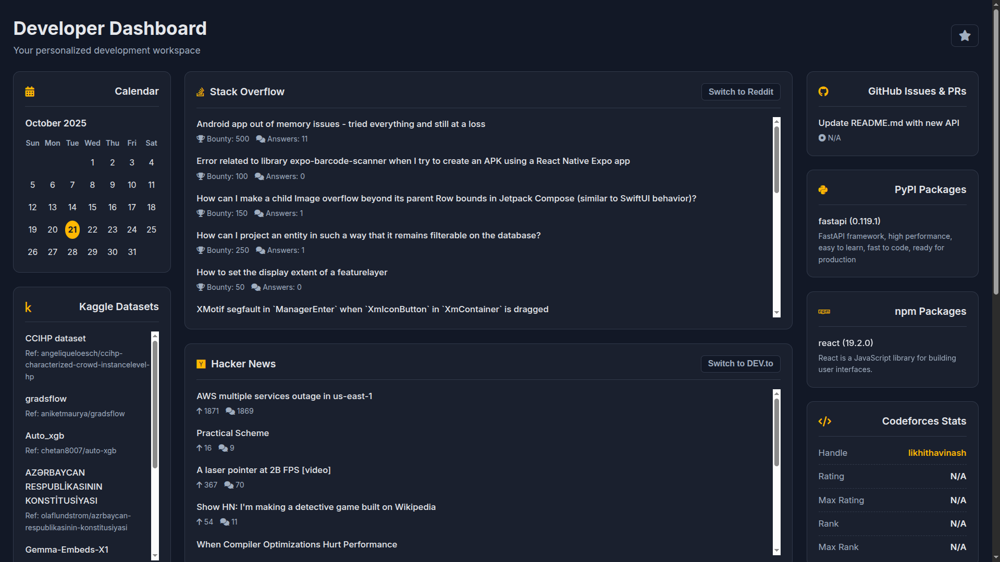
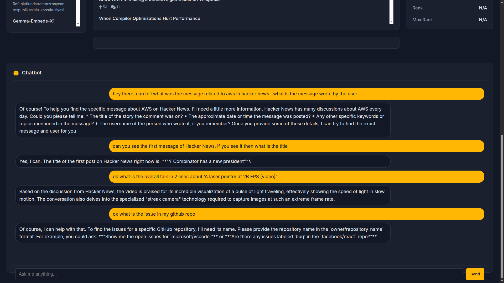

# Dev Aggregator
<p align="center">


</p>   

## Problem
Developers rely on multiple websites and tools such as GitHub, Stack Overflow, Kaggle, and Hacker News to stay updated and work efficiently. Constantly switching between tabs leads to distraction, wasted time, and fragmented workflows. There is no single platform that combines all developer-centric content, updates, and AI assistance into one seamless experience.

## Solution 
DevStream provides a centralized dashboard where all developer resources are displayed together in a clean, minimal Blue-theme/Dark-theme interface.The integrated AI assistant helps summarize news, answer technical questions, and interact with feeds — making the process faster, smarter, and distraction-free.

The dashboard includes:  
   - A calendar for important dates  
   - Latest tech news  
   - Popular programming questions  
   - GitHub updates  
   - Datasets from Kaggle  
   - Installed software packages  
   - A built-in AI chatbot to answer questions and help with tasks  
   - A User can also change the theme either to Dark/Blue theme, which suits perfect for this dashboard

### 🎯 Summary  
This dashboard brings everything a developer needs into one place, helping save time, reduce distractions, and make the workflow faster and more organized. Even for non-developers, it works as a smart digital assistant that provides information clearly and quickly — all from one screen.

## ✨ Features
:arrow_right: **All-in-One Access** → View tech news, programming questions, datasets, and development updates from multiple platforms (Hacker News, StackOverflow, Kaggle, GitHub, PyPI, npm, etc.) in one dashboard.

:arrow_right: **Smart Insights** → The built-in AI assistant can explain posts, summarize discussions, and answer follow-up questions instantly.

:arrow_right: **Real-Time Updates** → Automatically refreshes content so you always see the latest news, issues, and changes related to your tech stack.

:arrow_right: **Developer Assistant** → Helps check repository issues, clarify errors, fetch programming info, and generate clean summaries.

:arrow_right: **Minimal Distraction Experience** → Blue-theme UI & Dark-theme UI designed to reduce context switching and boost developer focus.

:arrow_right: **Cross-Platform Compatibility** → Works on Windows, macOS, and Linux via browser.

## 📂 Project Structure
The project is organized with a main aggregator that calls modular, single-purpose scripts.

```
📂 Aggregator
├── 📂 app
│   ├── 📂 aggregator  # Core aggregator logic (entrypoints + main pipeline)
│   │   ├── __init__.py
│   │   └── aggregator_main.py
│   ├──📂 endpoints   #  API endpoints (GitHub, PyPI, Reddit, StackOverflow, etc.)
│   │   ├── github_ep.py
│   │   ├── hn.py
│   │   ├── npm.py
│   │   ├── pypi.py
│   │   ├── reddit.py
├   |   |── codeforces.py
│   |   ├── devto.py
│   |   ├── gfg.py
│   |   ├── github.py
│   |   ├── gitlab.py
│   |   ├── hacker_news.py
│   |   ├── __init__.py
│   |   ├── kaggle.py
│   |   └── stackoverflow.py
│   │   └── so.py
|   ├── index.html
|   ├──📂 css
│   |  └── style.css
|   ├──📂 js
│   |  ├── api.js
│   |  ├── app.js
│   |  ├── react-loader-chatbot.js
│   |  ├── react-loader.js
│   |  ├── react-loader-news.js
│   |  ├── react-loader-theme.js
│   |  └── ui.js    
├── 📂 logic_diagram
│   ├── logic.svg     # Visual diagram of system flow
│   └── logic.txt     # Textual logic/architecture notes
├── n.txt
├── requirements.txt  # Python dependencies
├── README.md         # Project documentation     
└── .gitignore        # Ignored files for cleaner repo
```

## 🛠️ Setup Instructions
Follow these steps to get the project running on your local machine.

### 1. Prerequisites
- Python 3.8 or higher

- Git

### 2. Clone the Repository
- First, clone the project to your local machine

- Navigate to that folder `cd Aggregator`

### 3. Create a Virtual Environment
   It is highly recommended to use a virtual environment to manage dependencies.

   #### Create the environment:
      python -m venv venv

   ### Activate the environment
   - On Windows:

         venv\Scripts\activate
     
   - On macOS / Linux:

         source venv/bin/activate

### 4. Install Dependencies
   Install all the required Python libraries using pip:

        pip install -r requirements.txt

### 5. Configure Environment Variables
- The script uses a .env file to securely store your API keys and credentials.

- Create your .env file by making a copy of the template:

- cp .env.example .env

- Open the .env file with a text editor.

- Add your personal API keys and usernames for each service. The file contains comments guiding you on where to find them. This file is included in .gitignore and will not be seen in the repository.

## API Key Links

### 1. DEV.to 👩‍💻
As before, you can generate your DEV.to API key from your account settings.

Link: [Dev.to](https://dev.to/settings/extensions)

Instructions: Scroll down to the "DEV Community API Keys" section and click the "Generate API Key" button.

### 2. GitHub 🐙
GitHub calls its API keys Personal Access Tokens (PATs).

Link: [Github](https://github.com/settings/tokens)

Instructions: Click on "Generate new token". You can choose between a fine-grained token (more secure) or a classic token. Give it a name, set an expiration date, and select the scopes (permissions) it needs.

### 3. Codeforces ⚔️
Codeforces allows you to generate API keys directly from your profile settings.

Link: [Codeforces](https://codeforces.com/settings/api)

Instructions: Click the "Add API key" button. It will generate a key and a secret that you can use for API calls.

### 4. Kaggle 📊
Kaggle's API key is provided in a downloadable file.

Link: Go to your account page: [Kaggle](https://www.kaggle.com/account)

Instructions: Scroll down to the "API" section and click the "Create New API Token" button. This will download a kaggle.json file to your computer. Your username and key are inside this file.

### 5. Gemini 🦊
Similar to GitHub, GitLab uses Personal Access Tokens.

Link: [Gemini](https://aistudio.google.com/app/api-keys)

Instructions: Give your token a name, set an expiration date, and choose the necessary scopes (permissions). Then click "Create personal access token".

### 6. Hacker News 📰
For this service, you get your API key after signing up and logging into your dashboard.

Link: [Hacker News](https://hacker-news.firebaseio.com/v0)

Instructions: After you log in or sign up, your API key will be displayed directly on your main dashboard.

### 7. Stack Overflow (Stack Exchange) 📚
Instructions: Fill out the form to register your application. Once registered, you will be given a key that you can include in your API requests.

Link: [Stack Overflow](https://stackoverflow.com/users/current)

When you visit your profile, the URL in your browser's address bar will look like this(It is Example): `https://stackoverflow.com/users/**1234567**/Your-Display-Name`

# FOR Web App
## 🚀 How to Run
   - Ensure your virtual environment is activated before running the scripts.

   #### For Python:
   
   **To activate virtual environment:** `venv\Scripts\activate`         
      
   **For Mac/Linux:** `source venv/bin/activate`    

   **RUN THIS FIRST:** For Loading the Backend
   
    python -m uvicorn aggregator.aggregator_main:app --reload 

   For loading the Frontend:  
         
    python -m http.server 8001
       
   #### For Python3:
  
   **TO activate the virtual environment:** `source venv/bin/activate`

   **RUN THIS FIRST:** For Loading the Backend
   
    python -m uvicorn aggregator.aggregator_main:app --reload 

   For loading the Frontend:  
         
    python3 -m http.server 8001
   

## 🤔 How it works

- For a visual representation of the project's logic, please see the [LLD](logic_diagram/logic.svg).
